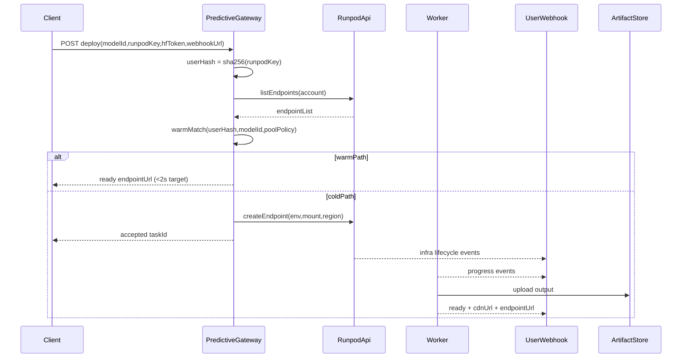

# Visgate Predictive Stateless Roadmap

## Intent

This roadmap is the canonical implementation guide for future agents working on `visgate-deploy-api`.

Target architecture:
- Stateless predictive gateway
- Runpod-first warm discovery and cold provisioning
- Image/video model focus (no LLM scope in this track)
- Hybrid cost-aware warm pool
- fal.ai-like UX with stronger privacy and lower operating margin

## Scope Lock

- Workloads: **image + video** inference only
- Authentication: request-time `RUNPOD_API_KEY` (no persistent user secret storage)
- Delivery mode: asynchronous webhook and CDN links
- Policy: hybrid warm pool (always-on only for selected models/time windows)

## Current Distance Estimate

- Predictive Gateway: 30%
- Ultra-Fast Provisioning: 35%
- Optimized Worker Engine: 15%
- Async Delivery Loop: 20%
- Modular HF image/video adapters: 25%
- Overall: ~70% gap to target

## Target Flow

## Core Implementation Phases

## Phase 0 - Predictive Gateway (Stateless Cutover)
- Remove Firestore-centric API key dependency from critical request path
- Compute deterministic `userHash` in-memory per request
- Keep gateway response contracts ephemeral (`warm_ready` or `accepted_cold`)

## Phase 1 - Warm Discovery + Hybrid Cost-Aware Pool
- Implement Runpod-native discovery by deterministic endpoint naming/tagging
- Add pool policy config:
  - `always_on` for selected top models
  - `scheduled_warm` for peak windows
  - `on_demand` fallback for long-tail models

## Phase 2 - Ultra-Fast Provisioning
- Use cache-first model loading path (Runpod S3/network volume)
- Prefer mount/copy over public internet HF fetch for cold starts
- Add region-aware endpoint placement for lower data-transfer latency

## Phase 3 - Optimized Worker Engine (Image/Video)
- Add backend runtime abstraction for optimized execution engines
- Keep safe fallback runtime for unsupported GPU/runtime combinations
- Track TTFT and generation latency per model family

## Phase 4 - Async Delivery Loop
- Upload outputs to object storage at completion
- Deliver CDN-ready URLs via webhook payload (avoid heavy base64-first flow)
- Standardize status payloads: provisioning, started, progress, ready, failed

## Phase 5 - Modular HF Image/Video Compatibility
- Replace regex-only model routing with capability-based adapters
- Add task-aware schemas (text2img, image2img, text2video)
- Add preflight compatibility checks before endpoint provisioning

## Phase 6 - Repo and CI Hardening
- Remove stale docs/script paths and duplicate operational scripts
- Remove masked CI outcomes (`|| true`) from lint/test/build gates
- Keep one canonical E2E script and one canonical cleanup script

## Fal.ai-Parity Critical Additions (Mandatory)

The following five controls are mandatory and must be implemented as first-class features:

1. **Auto-Cleanup Watchdog**
- Worker-side watchdog for idle/error cleanup to protect user billing
- Endpoint termination policy on:
  - fatal startup error
  - repeated inference failure threshold
  - configurable idle timeout

2. **Live Log Tunneling (Stateless)**
- Provide stateless log streaming channel for active jobs/endpoints
- User can subscribe to GPU lifecycle/inference logs without DB dependency

3. **Secret Masking**
- Redact Runpod/HF keys and sensitive env values from all logs/events
- Apply masking in gateway logs, worker logs, and webhook payload diagnostics

4. **Rate Limiting**
- Add lightweight IP or `userHash`-based throttling at gateway ingress
- Protect Cloud Run cost and abuse surface while preserving burst tolerance

5. **Geo-Routing**
- Add region matching logic for:
  - model cache location (S3/volume)
  - GPU endpoint location
- Goal: maximize cache-to-GPU throughput and reduce warm/cold latency

## Acceptance Criteria

- Warm hit returns endpoint in under 2 seconds
- Cold path returns immediate acceptance response (no long sync orchestration)
- Webhook receives progress and ready events with CDN URL
- No raw secrets appear in logs
- Auto-cleanup prevents idle billing leaks
- CI blocks regressions deterministically
