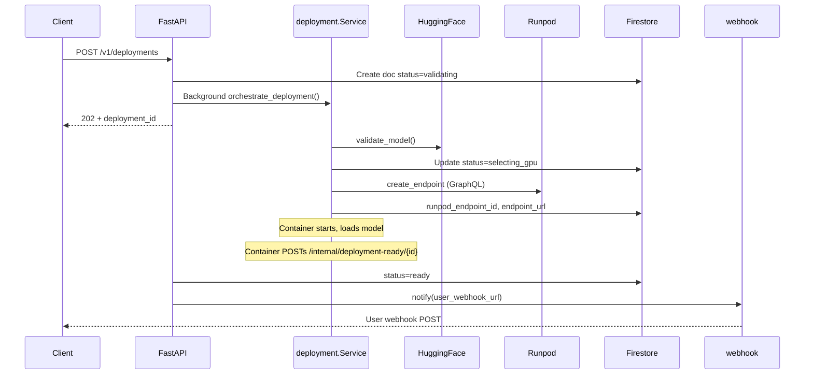

# Visgate Deploy API

GCP Cloud Run deployment orchestrator: validates Hugging Face models, creates Runpod serverless endpoints, tracks lifecycle in Firestore, and notifies users via webhook.

## Architecture



## API

### POST /v1/deployments

Creates a deployment (async). Returns 202 with `deployment_id`; processing continues in background.

**Request:**
```json
{
  "hf_model_id": "black-forest-labs/FLUX.1-schnell",
  "user_runpod_key": "rpa_xxx",
  "user_webhook_url": "https://your-app.com/webhook",
  "gpu_tier": "A40",
  "hf_token": "optional_for_gated_models"
}
```

**Response (202):**
```json
{
  "deployment_id": "dep_2024_abc123",
  "status": "validating",
  "model_id": "black-forest-labs/FLUX.1-schnell",
  "estimated_ready_seconds": 180,
  "webhook_url": "https://your-app.com/webhook",
  "created_at": "2024-02-14T10:00:00Z"
}
```

### GET /v1/deployments/{deployment_id}

Returns current status, Runpod endpoint URL, logs, and error (if failed).

**Response:** `status` one of: `validating`, `selecting_gpu`, `creating_endpoint`, `downloading_model`, `loading_model`, `ready`, `failed`, `webhook_failed`.

### DELETE /v1/deployments/{deployment_id}

Tears down the Runpod endpoint and marks deployment deleted. Returns 204.

### Health

- **GET /health** – Liveness (<10ms).
- **GET /readiness** – Checks Firestore connection.

- **[USAGE.md](USAGE.md)** - Local run steps, endpoint tests (curl examples), and real response samples.

## Inference image (Runpod worker)

**Flow:** Runpod starts a pod using the template’s Docker image (our inference image). The orchestrator passes **endpoint env** (`HF_MODEL_ID`, `VISGATE_WEBHOOK`, optional `HF_TOKEN`) when creating the endpoint. The container starts, loads the Hugging Face model from `HF_MODEL_ID`, then POSTs to `VISGATE_WEBHOOK` so the orchestrator can set status to `ready` and call your webhook. After that, requests to the endpoint run inference with that model.

1. **Create Runpod template** (once; uses our image so Runpod can start it):
   ```bash
   # From repo root: ensure .env.local has RUNPOD= and IMAGE= (or DOCKER_IMAGE=)
   cd deploy-api && .venv/bin/python scripts/create_runpod_template.py
   # Add printed RUNPOD_TEMPLATE_ID=... to .env
   ```

2. **Build and push** the inference image to Docker Hub so Runpod can pull it:
   ```bash
   cd ../inference && ./build-and-push.sh
   ```

See [inference/README.md](../inference/README.md) for supported models, job I/O, and how to send requests to the endpoint and get results.

## Local development

1. **Environment**
   ```bash
   cp .env.example .env
   # Set GCP_PROJECT_ID=visgate and optionally RUNPOD_TEMPLATE_ID.
   ```

2. **GCP auth** (for Firestore / Secret Manager)
   ```bash
   gcloud auth application-default login
   gcloud config set project visgate
   ```

3. **Run**
   ```bash
   cd deploy-api
   pip install -r requirements.txt
   export PYTHONPATH=.
   uvicorn src.main:app --reload --port 8080
   ```

4. **Firestore emulator** (optional)
   ```bash
   docker run -p 8080:8080 gcr.io/google.com/cloudsdktool/google-cloud-cli:emulators gcloud emulators firestore start --host-port=0.0.0.0:8080
   export FIRESTORE_EMULATOR_HOST=localhost:8080
   ```

## Deployment (GCP)

1. **Build and push**
   ```bash
   gcloud builds submit --config=cloudbuild.yaml .
   ```

2. **Or use deploy script**
   ```bash
   chmod +x deploy.sh
   ./deploy.sh
   ```

3. **Set secrets** in Secret Manager and env:
   - `RUNPOD_TEMPLATE_ID` – Runpod serverless template that uses our inference image (create via `scripts/create_runpod_template.py`).
   - `INTERNAL_WEBHOOK_SECRET` – Optional secret for `/internal/deployment-ready` callback.

## Troubleshooting

| Error | Cause | Solution |
|-------|--------|----------|
| `HuggingFaceModelNotFoundError` | Model ID invalid or gated without token | Check `hf_model_id`; set `hf_token` for gated models. |
| `RunpodInsufficientGPUError` | No GPU with enough VRAM | Choose larger `gpu_tier` or add GPUs in Runpod. |
| `RUNPOD_TEMPLATE_ID not set` | Missing template | Create a Runpod template for your image and set env. |
| 401 Unauthorized | Missing/invalid Bearer token | Send `Authorization: Bearer <api_key>`. |
| 429 Rate limit | >100 req/min per API key | Back off; use `Retry-After` header. |

## Performance

- **/health**: <10ms p99.
- **POST /v1/deployments**: <200ms (async processing).
- **GET /v1/deployments/{id}**: <50ms p99 with Firestore.

## Model specs (registry)

Preconfigured models: `black-forest-labs/FLUX.1-schnell`, `black-forest-labs/FLUX.1-dev`, `stabilityai/sdxl-turbo`. See `src/models/model_specs_registry.py` for VRAM and GPU mapping.
