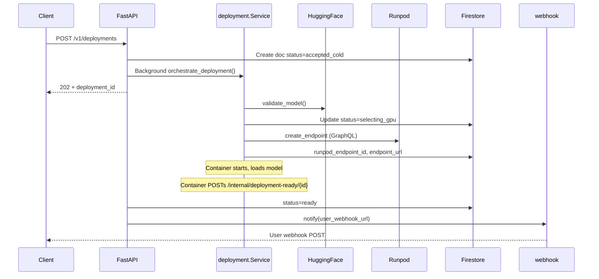

# Visgate Deploy API

GCP Cloud Run deployment orchestrator: validates Hugging Face models, creates Runpod serverless endpoints, tracks lifecycle in Firestore, and notifies users via webhook.

## Architecture


```mermaid
sequenceDiagram
    participant Client
    participant API as FastAPI
    participant Orch as deployment.Service
    participant HF as HuggingFace
    participant RP as Runpod
    participant FS as Firestore
    participant WH as webhook

    Client->>API: POST /v1/deployments
    API->>FS: Create doc status=accepted_cold
    API->>Orch: Background orchestrate_deployment()
    API-->>Client: 202 + deployment_id

    Orch->>HF: validate_model()
    Orch->>FS: Update status=selecting_gpu
    Orch->>RP: create_endpoint (GraphQL)
    Orch->>FS: runpod_endpoint_id, endpoint_url
    Note over Orch: Container starts, loads model
    Note over Orch: Container POSTs /internal/deployment-ready/{id}
    API->>FS: status=ready
    API->>WH: notify(user_webhook_url)
    WH-->>Client: User webhook POST
```

## API

### POST /v1/deployments

Creates a deployment (async). Returns 202 with `deployment_id`; processing continues in background.

**Request:**
```json
{
  "hf_model_id": "black-forest-labs/FLUX.1-schnell",
  "user_webhook_url": "https://your-app.com/webhook",
  "gpu_tier": "A40",
  "hf_token": "optional_for_gated_models"
}
```

**Response (202):**
```json
{
  "deployment_id": "dep_2026_abc123",
  "status": "accepted_cold",
  "model_id": "black-forest-labs/FLUX.1-schnell",
  "estimated_ready_seconds": 180,
  "webhook_url": "https://your-app.com/webhook",
  "path": "cold",
  "created_at": "2026-03-04T10:00:00Z"
}
```

### GET /v1/deployments/{deployment_id}

Returns current status, Runpod endpoint URL, logs, and error (if failed).

**Response:** `status` progression: `accepted_cold` → `validating` → `selecting_gpu` → `creating_endpoint` → `loading_model` → `ready`. Terminal states: `failed`, `webhook_failed`.

### DELETE /v1/deployments/{deployment_id}

Tears down the Runpod endpoint and marks deployment deleted. Returns 204.

### Health

- **GET /health** – Liveness (<10ms).
- **GET /readiness** – Checks Firestore connection.
- **GET /metrics** – JSON counters: deployments created, webhook failures, RunPod errors, p50/p95 durations.

See [USAGE.md](USAGE.md) for local run steps and curl examples.

## Inference image (Runpod worker)

**Flow:** Runpod starts a pod using the template’s Docker image (our inference image). The orchestrator passes **endpoint env** (`HF_MODEL_ID`, `VISGATE_WEBHOOK`, optional `HF_TOKEN`) when creating the endpoint. The container starts, loads the Hugging Face model from `HF_MODEL_ID`, then POSTs to `VISGATE_WEBHOOK` so the orchestrator can set status to `ready` and call your webhook. After that, requests to the endpoint run inference with that model.

1. **Create Runpod template** (once; uses our image so Runpod can start it):
   ```bash
   # From repo root: ensure .env.local has RUNPOD= and IMAGE= (or DOCKER_IMAGE=)
   cd deploy-api && .venv/bin/python scripts/create_runpod_template.py
   # Add printed RUNPOD_TEMPLATE_ID=... to .env
   ```

2. **Build and push** the inference image to Docker Hub so Runpod can pull it:
   ```bash
   cd ../inference && ./build-and-push.sh
   ```

See [inference/README.md](../inference/README.md) for supported models, job I/O, and how to send requests to the endpoint and get results.

## Local development

1. **Environment**
   ```bash
   cp .env.example .env
   # Set GCP_PROJECT_ID=visgate and optionally RUNPOD_TEMPLATE_ID.
   ```

2. **GCP auth** (for Firestore / Secret Manager)
   ```bash
   gcloud auth application-default login
   gcloud config set project visgate
   ```

3. **Run**
   ```bash
   cd deploy-api
   pip install -r requirements.txt
   export PYTHONPATH=.
   uvicorn src.main:app --reload --port 8080
   ```

4. **Firestore emulator** (optional)
   ```bash
   docker run -p 8080:8080 gcr.io/google.com/cloudsdktool/google-cloud-cli:emulators gcloud emulators firestore start --host-port=0.0.0.0:8080
   export FIRESTORE_EMULATOR_HOST=localhost:8080
   ```

## Deployment (GCP)

1. **Build and push**
   ```bash
   gcloud builds submit --config=cloudbuild.yaml .
   ```

2. **Or use deploy script**
   ```bash
   chmod +x deploy.sh
   ./deploy.sh
   ```

3. **Set secrets** in Secret Manager and env:
   - `RUNPOD_TEMPLATE_ID` – Runpod serverless template that uses our inference image (create via `scripts/create_runpod_template.py`).
   - `INTERNAL_WEBHOOK_SECRET` – Optional secret for `/internal/deployment-ready` callback.
   - Tip: use `sm://SECRET_NAME` to auto-resolve from GCP Secret Manager.

4. **Create Cloud Tasks queue** (recommended for production — eliminates F6 scale-to-zero risk):
   ```bash
   gcloud tasks queues create visgate-orchestration \
     --location=us-central1 --project=YOUR_PROJECT
   # Then set in Cloud Run env:
   # CLOUD_TASKS_QUEUE_PATH=projects/YOUR_PROJECT/locations/us-central1/queues/visgate-orchestration
   # INTERNAL_WEBHOOK_BASE_URL=https://your-cloud-run-service.run.app
   # CLOUD_TASKS_SERVICE_ACCOUNT=your-sa@YOUR_PROJECT.iam.gserviceaccount.com
   ```
   The SA needs `roles/cloudtasks.enqueuer` + `roles/run.invoker` + `roles/secretmanager.admin`.

## Troubleshooting

| Error | Cause | Solution |
|-------|--------|----------|
| `HuggingFaceModelNotFoundError` | Model ID invalid or gated without token | Check `hf_model_id`; set `hf_token` for gated models. |
| `RunpodInsufficientGPUError` | No GPU with enough VRAM | Choose larger `gpu_tier` or add GPUs in Runpod. |
| `RUNPOD_TEMPLATE_ID not set` | Missing template | Create a Runpod template for your image and set env. |
| 401 Unauthorized | Missing/invalid Runpod key | Send `Authorization: Bearer <RUNPOD_API_KEY>`. |
| 429 Rate limit | >100 req/min per user hash | Back off; use `Retry-After` header. |

## Performance

- **/health**: <10ms p99.
- **POST /v1/deployments**: <200ms (async processing).
- **GET /v1/deployments/{id}**: <50ms p99 with Firestore.

## Model specs (registry)

Preconfigured models with hand-tuned VRAM values (no byte-estimation needed):
`black-forest-labs/FLUX.1-schnell`, `black-forest-labs/FLUX.1-dev`, `stabilityai/sdxl-turbo`,
`stabilityai/stable-diffusion-xl-base-1.0`, `stabilityai/sd-turbo`, `stabilityai/stable-diffusion-2-1`,
`runwayml/stable-diffusion-v1-5`, `PixArt-alpha/PixArt-Sigma-XL-2-1024-MS`, and more.
See [`src/models/model_specs_registry.py`](src/models/model_specs_registry.py). Unknown models fall back to safetensors byte-estimation with 1.35× headroom.

## Examples

Tested on production — 2026-03-04, `stabilityai/sdxl-turbo`, 129s end-to-end.

```bash
BASE="https://visgate-deploy-api-wxup7pxrsa-uc.a.run.app"
RP_KEY="rpa_..."
```

**1. Create deployment**
```bash
curl -s -X POST $BASE/v1/deployments \
  -H "Authorization: Bearer $RP_KEY" \
  -H "Content-Type: application/json" \
  -d '{"hf_model_id":"stabilityai/sdxl-turbo","user_webhook_url":"https://httpbin.org/post"}'
# → 202  {"deployment_id":"dep_2026_400ea2c4","status":"accepted_cold","estimated_ready_seconds":180}
```

**2. Poll until ready (~121s)**
```bash
curl -s $BASE/v1/deployments/dep_2026_400ea2c4 \
  -H "Authorization: Bearer $RP_KEY" | jq .status
# validating → creating_endpoint → loading_model → "ready"
# .endpoint_url = "https://api.runpod.ai/v2/{endpoint_id}/run"
```

**3. Generate image (3s)**
```bash
curl -s -X POST https://api.runpod.ai/v2/{endpoint_id}/runsync \
  -H "Authorization: Bearer $RP_KEY" \
  -H "Content-Type: application/json" \
  -d '{"input":{"prompt":"aerial view of Istanbul at sunset","num_inference_steps":4,"guidance_scale":0.0,"width":512,"height":512,"seed":42}}' \
  | jq -r '.output.image_base64' | base64 -d > output.png
# → 512×512px PNG, 535 KB
```

**4. Cleanup**
```bash
curl -s -X DELETE $BASE/v1/deployments/dep_2026_400ea2c4 \
  -H "Authorization: Bearer $RP_KEY"
# → 204
```

| Stage | Time |
|---|---|
| Deploy accepted | <1s |
| Container ready | ~121s |
| Inference (4 steps) | 3s |
| **Total** | **129s** |
